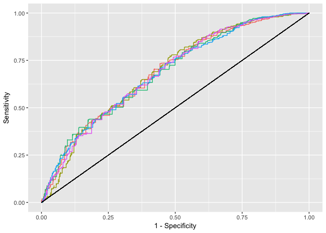

Supplementary Information for the paper "Identifying patients using antidepressants for the treatment of depression"
====================================================================================================================

This R package contains similar (synthetic) data to the dataset used in the paper, and all R code used in the analysis.

### Install this package

``` r
install.packages('devtools')
devtools::install_github("strakaps/antidepressants")
```

### Load synthetic data

``` r
library(antidepressants)
data("synthetic")
```

### Bootstrap and fit glinternet models

``` r
bootglinternet(B = 10, nLambda = 20)
```

### All coefficients of the model fitted to the real dataset

See the file [all\_coefs.md](all_coefs.md) or [all\_coefs.csv](inst/extdata/all_coefs.csv)

### Reproduce analysis

View the `README.Rmd` file that produces the output below.

### Calculating AUC

For each value of *λ*, we give the mean value of the AUC (Area under the ROC curve) and its standard deviation:


The best expected AUC is 0.7030967 and our choice within one standard deviation is 0.6929934.

### Sensitivity and Specificity

|  threshold|  gold|  positives|   sens|   spec|    ppv|
|----------:|-----:|----------:|------:|------:|------:|
|        0.1|  1323|     1115.8|  1.000|  0.000|  0.438|
|        0.2|  1323|     1111.8|  0.999|  0.006|  0.439|
|        0.3|  1323|     1002.2|  0.972|  0.159|  0.474|
|        0.4|  1323|      772.2|  0.833|  0.417|  0.527|
|        0.5|  1323|      285.7|  0.378|  0.839|  0.655|
|        0.6|  1323|       31.9|  0.044|  0.983|  0.676|
|        0.7|  1323|        0.0|  0.000|  1.000|    NaN|
|        0.8|  1323|        0.0|  0.000|  1.000|    NaN|
|        0.9|  1323|        0.0|  0.000|  1.000|    NaN|

ROC plot
--------

Plot ROC curves of 5 bootstrap samples.



### Bootstrap Percentiles for effects and interactions


### Which effects were picked

| effect\_name  |  num\_level|
|:--------------|-----------:|
| amitriptyline |           4|
| mirtazapine   |           3|
| reboxetine    |           2|
| comed\_iron   |           2|
| age           |           1|

### Which interactions were picked

| effect\_name\_1 | effect\_name\_2 |
|:----------------|:----------------|
| amitriptyline   | mirtazapine     |
| amitriptyline   | reboxetine      |
| amitriptyline   | comed\_iron     |
