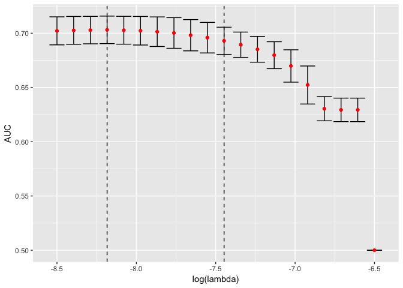
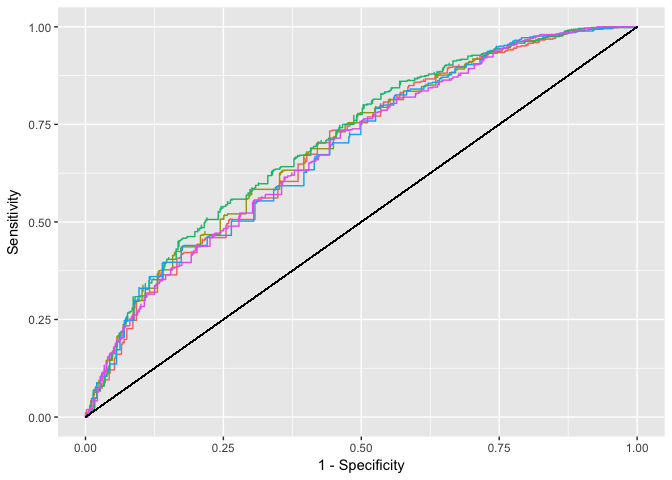
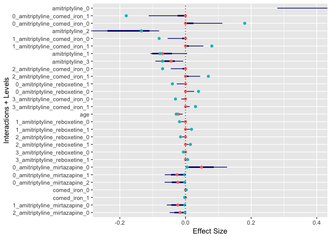

Description
-----------

This Notebook contains the R code for the analysis in the paper titled as above. For confidential reasons, the analysis is reproduced on a synthetic dataset only. Hence the signal is weaker, and different effects are identified.

Bootstrap glinternet
--------------------

First, generate `B` Bootstrap samples from the synthetic data, and save them as `data/glinternet_models.RData`:

``` r
bootglinternet(B=10)
```

Calculating AUC
---------------

For each value of *λ*, we give the mean value of the AUC (Area under the ROC curve) and its standard deviation:



The best expected AUC is 0.7030967 and our choice within one standard deviation is 0.6929934.

Sensitivity and Specificity
---------------------------

    ## Loading tidyverse: tidyr
    ## Loading tidyverse: readr
    ## Loading tidyverse: purrr
    ## Loading tidyverse: dplyr

    ## Conflicts with tidy packages ----------------------------------------------

    ## arrange():   dplyr, plyr
    ## compact():   purrr, plyr
    ## count():     dplyr, plyr
    ## failwith():  dplyr, plyr
    ## filter():    dplyr, stats
    ## id():        dplyr, plyr
    ## lag():       dplyr, stats
    ## mutate():    dplyr, plyr
    ## rename():    dplyr, plyr
    ## summarise(): dplyr, plyr
    ## summarize(): dplyr, plyr

|  threshold|  gold|  positives|   sens|   spec|    ppv|
|----------:|-----:|----------:|------:|------:|------:|
|        0.1|  1323|     1115.8|  1.000|  0.000|  0.438|
|        0.2|  1323|     1111.8|  0.999|  0.006|  0.439|
|        0.3|  1323|     1002.2|  0.972|  0.159|  0.474|
|        0.4|  1323|      772.2|  0.833|  0.417|  0.527|
|        0.5|  1323|      285.7|  0.378|  0.839|  0.655|
|        0.6|  1323|       31.9|  0.044|  0.983|  0.676|
|        0.7|  1323|        0.0|  0.000|  1.000|    NaN|
|        0.8|  1323|        0.0|  0.000|  1.000|    NaN|
|        0.9|  1323|        0.0|  0.000|  1.000|    NaN|

ROC plot
--------

Plot ROC curves of 5 bootstrap samples.



"Confidence" intervals for effects and interactions
---------------------------------------------------



### Which effects were picked

| effect\_name  |  num\_level|
|:--------------|-----------:|
| amitriptyline |           4|
| mirtazapine   |           3|
| reboxetine    |           2|
| comed\_iron   |           2|
| age           |           1|

### Which interactions were picked

| effect\_name\_1 | effect\_name\_2 |
|:----------------|:----------------|
| amitriptyline   | mirtazapine     |
| amitriptyline   | reboxetine      |
| amitriptyline   | comed\_iron     |

### All coefficients printed out

| id                               |   value|     OR|   CIlo|   CIhi|
|:---------------------------------|-------:|------:|------:|------:|
| amitriptyline\_0                 |   0.869|  2.384|  1.323|  8.475|
| intercept                        |   0.435|  1.545|  1.545|  1.545|
| 0\_amitriptyline\_comed\_iron\_1 |  -0.181|  0.835|  0.894|  1.000|
| 0\_amitriptyline\_comed\_iron\_0 |   0.181|  1.198|  1.000|  1.119|
| amitriptyline\_2                 |  -0.135|  0.874|  0.751|  0.923|
| 1\_amitriptyline\_comed\_iron\_0 |  -0.080|  0.923|  0.947|  1.000|
| 1\_amitriptyline\_comed\_iron\_1 |   0.080|  1.084|  1.000|  1.056|
| amitriptyline\_1                 |  -0.078|  0.925|  0.899|  1.005|
| amitriptyline\_3                 |  -0.070|  0.932|  0.912|  0.993|
| 2\_amitriptyline\_comed\_iron\_0 |  -0.070|  0.933|  0.956|  1.000|
| 2\_amitriptyline\_comed\_iron\_1 |   0.070|  1.072|  1.000|  1.046|
| 0\_amitriptyline\_reboxetine\_1  |  -0.040|  0.961|  0.974|  1.000|
| 0\_amitriptyline\_reboxetine\_0  |   0.040|  1.041|  1.000|  1.027|
| 3\_amitriptyline\_comed\_iron\_0 |  -0.031|  0.970|  0.987|  1.000|
| 3\_amitriptyline\_comed\_iron\_1 |   0.031|  1.031|  1.000|  1.013|
| age                              |  -0.028|  0.972|  0.970|  0.991|
| 1\_amitriptyline\_reboxetine\_0  |  -0.018|  0.982|  0.987|  1.000|
| 1\_amitriptyline\_reboxetine\_1  |   0.018|  1.018|  1.000|  1.013|
| 2\_amitriptyline\_reboxetine\_0  |  -0.015|  0.985|  0.990|  1.000|
| 2\_amitriptyline\_reboxetine\_1  |   0.015|  1.015|  1.000|  1.010|
| 3\_amitriptyline\_reboxetine\_0  |  -0.006|  0.994|  0.997|  1.000|
| 3\_amitriptyline\_reboxetine\_1  |   0.006|  1.006|  1.000|  1.003|
| 0\_amitriptyline\_mirtazapine\_0 |   0.005|  1.005|  1.000|  1.135|
| 0\_amitriptyline\_mirtazapine\_1 |  -0.003|  0.997|  0.939|  1.000|
| 0\_amitriptyline\_mirtazapine\_2 |  -0.002|  0.998|  0.938|  1.000|
| comed\_iron\_0                   |   0.002|  1.002|  1.000|  1.002|
| comed\_iron\_1                   |  -0.002|  0.998|  0.998|  1.000|
| 1\_amitriptyline\_mirtazapine\_0 |  -0.002|  0.998|  0.945|  1.000|
| 2\_amitriptyline\_mirtazapine\_0 |  -0.002|  0.998|  0.953|  1.000|
| 1\_amitriptyline\_mirtazapine\_1 |   0.001|  1.001|  1.000|  1.029|
| 1\_amitriptyline\_mirtazapine\_2 |   0.001|  1.001|  1.000|  1.029|
| 2\_amitriptyline\_mirtazapine\_1 |   0.001|  1.001|  1.000|  1.024|
| 2\_amitriptyline\_mirtazapine\_2 |   0.001|  1.001|  1.000|  1.024|
| 3\_amitriptyline\_mirtazapine\_0 |  -0.001|  0.999|  0.978|  1.000|
| 3\_amitriptyline\_mirtazapine\_1 |   0.000|  1.000|  1.000|  1.011|
| 3\_amitriptyline\_mirtazapine\_2 |   0.000|  1.000|  1.000|  1.011|
| reboxetine\_0                    |   0.000|  1.000|  1.000|  1.000|
| reboxetine\_1                    |   0.000|  1.000|  1.000|  1.000|
| mirtazapine\_1                   |   0.000|  1.000|  0.999|  1.000|
| mirtazapine\_2                   |   0.000|  1.000|  0.999|  1.001|
| mirtazapine\_0                   |   0.000|  1.000|  1.000|  1.001|
